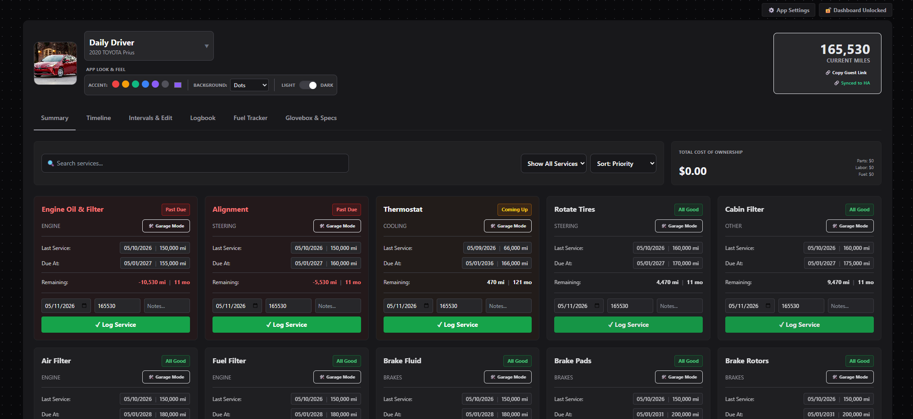

# Fleet Maintenance



> A powerful, self-hosted vehicle management system and predictive maintenance dashboard — built for enthusiasts who want complete control over their garage data.

Fleet Maintenance goes far beyond a simple logbook. It combines predictive maintenance math, job-specific "Garage Mode" toolcards, deep Home Assistant integration, and secure read-only guest sharing into one lightweight, self-hosted application. Your data never leaves your server.

---

## What's New

### 🌐 Community Blueprint Database
The biggest addition yet. When adding a new vehicle, the app now searches a community-maintained GitHub repository for matching configurations. If someone has already built out a thorough maintenance schedule for your make and model — services, part numbers, torque specs, garage toolcard items — you can import all of it in one click, or hand-pick exactly which services you want. No manual data entry required for common vehicles.

Contributing is just as easy. A **Contribute to Community** button in the Blueprints dropdown on the vehicle header strips all personal data and submits your config for review — no GitHub account needed. Submissions are moderated before going live.

### 📋 Blueprints Header Button
All blueprint actions — Save to Local Library, Contribute to Community, Export Blueprint, and Import Blueprint — are now consolidated into a single **📋 Blueprints** dropdown in the vehicle header, keeping the Intervals tab clean.

### 📚 Local Blueprint Library
Alongside the community database, blueprints can be saved to a private local library on your own instance. Useful when managing multiple vehicles of the same type — configure once, reuse across vehicles instantly without going through the community review process.

### 🔍 Logbook Search & Sort
The logbook now has a live search bar and a sort toggle (Newest First / Oldest First). Search matches against service name, notes, date, and mileage — results filter as you type.

### ⚡ Live Summary Card Updates
Logging a service on the Summary tab now instantly updates the card's status, colors, dates, and remaining mileage — no page refresh required.

---

## Table of Contents

- [Overview](#overview)
- [Feature Breakdown](#feature-breakdown)
  - [Multi-Vehicle Fleet Management](#multi-vehicle-fleet-management)
  - [Intelligent Interval Tracking](#intelligent-interval-tracking)
  - [Garage Mode](#garage-mode)
  - [Vehicle Specs & Torque Reference](#vehicle-specs--torque-reference)
  - [Maintenance Logbook](#maintenance-logbook)
  - [Fuel Tracking & Cost Analysis](#fuel-tracking--cost-analysis)
  - [Total Cost of Ownership (TCO)](#total-cost-of-ownership-tco)
  - [Smart AI Import / Export](#smart-ai-import--export)
  - [Read-Only Guest Sharing](#read-only-guest-sharing)
  - [Home Assistant Integration](#home-assistant-integration)
  - [MQTT Discovery](#mqtt-discovery)
  - [Global Settings & Personalization](#global-settings--personalization)
  - [Database Tools](#database-tools)
  - [Community Blueprints](#community-blueprints)
- [Installation: Option A — Home Assistant Add-on](#installation-option-a--home-assistant-add-on)
- [Installation: Option B — Standalone Docker](#installation-option-b--standalone-docker)
- [Environment Variable Reference](#environment-variable-reference)
- [Coming Soon](#coming-soon)
- [Legal Disclaimer](#legal-disclaimer)

---

## Overview

Fleet Maintenance is a Flask-based web application designed to run as either a **Home Assistant OS Add-on** or a **standalone Docker container**. It stores all data locally in a single JSON file, making it lightweight, portable, and easy to back up.

The app supports multiple vehicles simultaneously, each with its own maintenance schedule, logbook, fuel history, garage toolcard, and spec sheet. All data is tied to the vehicle's VIN, which can be decoded automatically via the NHTSA API.

**Supported architectures:** `amd64`, `aarch64`, `armv7`, `armhf`, `i386`, `x86_64`

---

## Feature Breakdown

### Multi-Vehicle Fleet Management

You can manage an entire garage from a single interface. Each vehicle is stored independently and is accessible via a top-level navigation bar.

**When adding a vehicle you can provide:**
- VIN (auto-decoded against the NHTSA database to fill in Year, Make, and Model)
- A custom nickname (e.g., "Daily Driver", "Weekend Truck")
- Current mileage
- A Home Assistant odometer sensor entity ID for live syncing
- A vehicle image URL for visual identification
- A custom accent/theme color per vehicle
- An optional CSV file to pre-populate the maintenance schedule

**VIN Auto-Decode** queries `https://vpic.nhtsa.dot.gov/api/` and automatically fills Year, Make, and Model fields — no manual lookup required.

---

### Intelligent Interval Tracking

This is the core engine of the app. Every service item is tracked by **both time (months) and distance (miles/km)**, and the app uses your vehicle's **Average Daily Mileage (ADM)** to predict which trigger will be hit first.

**How ADM is calculated:** The app analyzes your logbook entries that contain both a date and mileage reading. Once at least two entries exist and span more than 14 days, it computes your real-world average daily mileage. This figure is then used to project a predicted due date from the current mileage — giving you a more accurate forecast than a fixed calendar interval alone.

**Service status levels:**

| Status | Meaning |
|---|---|
| **Past Due** | The mileage or time interval has already been exceeded |
| **Coming Up** | Within your configured warning threshold (e.g., 1,000 miles or 1 month) |
| **All Good** | Service is not due soon |
| **Needs Baseline** | No last-service data has been entered yet; the app cannot calculate status |

Services are automatically sorted by urgency — Past Due items always appear first, followed by Needs Baseline, Coming Up, and All Good.

**Warning thresholds are fully configurable** under Global Settings. You can set the mileage window and month window that triggers the "Coming Up" status independently.

---

### Garage Mode

Garage Mode solves the problem of digging through a full spec sheet or manual when you only need the details for one specific job.

Click on any service item (e.g., "Engine Oil & Filter") and a focused toolcard opens showing **only the parts and torque specs relevant to that job**. This means you see the exact oil capacity, filter part number, drain plug torque — nothing else.

**Each service can store:**
- **Garage Parts** — Part name and value/spec (e.g., "Oil Filter → Motorcraft FL-820S", "Capacity → 5.7 qt")
- **Garage Torque Specs** — Component name and torque value specific to that job (e.g., "Drain Plug → 19 ft-lbs")

Items can be added, edited, and deleted live via AJAX — the Garage Mode modal stays open while you work, so you can build out your toolcard without losing your place.

---

### Vehicle Specs & Torque Reference

Each vehicle has a dedicated **Specs** tab that acts as a permanent reference sheet independent of any specific service job.

**Storable spec fields include:**
- Engine oil type and viscosity
- Oil filter part number
- Tire size
- Tire pressure (front/rear)
- Wiper blade sizes
- Battery installation date (used for the battery risk warning — see Home Assistant Integration)
- A link to the factory service manual URL

**Vehicle-wide Torque Specs table:** Beyond job-specific garage torque, there is a separate master torque spec table at the vehicle level. Each entry stores a component name, torque value, and one or more **labels**. Labels are tags you define (e.g., `front`, `suspension`, `engine`) that allow you to filter the torque table and find the spec you need fast when you're under the car. Add, edit, and delete entries live without a page reload.

---

### Maintenance Logbook

The logbook is a complete service history record for each vehicle.

**Each log entry records:**
- Date of service
- Service name (with smart autocomplete linked to your existing service intervals)
- Mileage at time of service
- Notes / technician comments
- Parts cost
- Labor cost

**Log and Track vs. Log Only:** When adding a log entry, you can choose whether to also update the interval tracker's "last serviced" baseline. This means you can log historical records without accidentally resetting your current maintenance countdown.

The logbook also feeds the ADM calculation — the more entries you have with mileage readings, the more accurate your predicted due dates become.

**CSV Import/Export:**
- **Export:** Download your full logbook as a CSV at any time (`Date, Service, Mileage, Notes, Parts, Labor`).
- **Import:** Upload a logbook CSV to bulk-import historical service records. Each imported row updates the corresponding interval tracker automatically.

---

### Fuel Tracking & Cost Analysis

Log every fill-up with a date and dollar amount. The app builds a running fuel cost history and automatically computes:

- **Total fuel spend** (all time)
- **Weekly average** fuel cost
- **Monthly average** fuel cost
- **Average cost per fill-up**

All fuel stats are displayed on the vehicle dashboard and are included in the Total Cost of Ownership calculation.

---

### Total Cost of Ownership (TCO)

The TCO panel aggregates every dollar you've spent on a vehicle across three categories:

| Category | Source |
|---|---|
| **Parts** | Sum of all `cost_parts` fields across the logbook |
| **Labor** | Sum of all `cost_labor` fields across the logbook |
| **Fuel** | Sum of all fuel log entries |
| **Total** | Combined sum of all three |

This gives you a real, data-backed answer to the question: *"How much has this vehicle actually cost me?"*

---

### Smart AI Import / Export

Fleet Maintenance includes built-in tooling to make working with external AI models (like ChatGPT or Claude) frictionless and accurate.

**"Copy AI Prompt" buttons** are available throughout the app. When clicked, they generate a prompt that includes your database's existing vocabulary — your actual service names, category labels, and part naming conventions. This context allows an AI model to generate a perfectly formatted, auto-linking CSV that matches your existing data structure exactly, rather than inventing its own inconsistent names.

**Supported AI-assisted workflows:**
- Generate a full vehicle-specific maintenance schedule CSV from an AI prompt (intervals, part numbers, categories)
- Populate the logbook with historical records via CSV import
- Rebuild or extend the default service template for new vehicles

**CSV format for service intervals (`import_csv`):**
```
Category,Service,Interval_Months,Interval_Miles,Parts_Info
Engine,Engine Oil & Filter,12,5000,Motorcraft FL-820S / 5W-30
Brakes,Brake Pads,60,50000,
```

**CSV format for logbook import (`import_logbook`):**
```
Date,Service,Mileage,Notes,Parts,Labor
2024-03-15,Engine Oil & Filter,87423,Synthetic 5W-30,32.50,0
```

---

### Read-Only Guest Sharing

Each vehicle automatically receives a unique, permanent share token (UUID) when it is added. This token generates a passwordless read-only URL:

```
http://your-server:5000/share/<token>
```

**What the guest link shows:**
- Full maintenance interval status (Past Due, Coming Up, All Good)
- Complete service history logbook
- Fuel stats summary
- TCO breakdown

**What the guest link cannot do:**
- Add, edit, or delete any data
- Access other vehicles in the fleet
- See admin settings or credentials

This is ideal for sharing upcoming maintenance info with a family member, or giving a mechanic a read-only view of a vehicle's history before a service appointment.

---

### Home Assistant Integration

Fleet Maintenance is built to run inside the Home Assistant ecosystem and takes advantage of it in several ways.

#### Live Odometer Sync

Each vehicle can be linked to a Home Assistant sensor entity (e.g., a sensor from an OBD2 Bluetooth integration, a Tesla integration, or a manual input helper). The app polls the HA REST API on a configurable interval (default: every 20 minutes, minimum: 5 minutes) and automatically updates the vehicle's current mileage.

To configure: enter the entity ID (e.g., `sensor.my_car_odometer`) in the vehicle settings panel.

#### Battery Risk Warning

If you enter a battery installation date in the Specs tab, the app monitors it against your HA outdoor temperature sensor. If **both** of the following conditions are true simultaneously, a high-risk warning banner is displayed on the vehicle dashboard:

1. The battery is older than **4 years** (1,460 days)
2. The current outdoor temperature (pulled from a HA sensor you configure) is **below 0°C**

To configure: set the `temp_entity_id` in Global Settings to any HA temperature sensor (e.g., `sensor.outdoor_temperature`).

#### HA Configuration Tab

When running as an add-on, credentials are configured directly in the Add-on Configuration tab in the Home Assistant UI. For standalone Docker, they are passed as environment variables.

---

### MQTT Discovery

Fleet Maintenance publishes all vehicle maintenance data to your MQTT broker using **Home Assistant MQTT Discovery** — the same protocol used by Zigbee2MQTT, ESPHome, and other integrations.

**What gets published:** Every service interval for every vehicle is published as a native Home Assistant sensor with full device grouping. No manual entity configuration required in HA.

**Each sensor includes the following attributes:**
- `status` — Current status string (`Past Due`, `Coming Up`, `All Good`, `Needs Baseline`)
- `miles_remaining` — Miles until service is due
- `months_remaining` — Months until service is due
- `due_date` — Projected due date
- `category` — Service category (Engine, Brakes, etc.)
- `service_name` — Full service name

Sensors are grouped under a device per vehicle (using the VIN as the unique identifier), and the device name defaults to the vehicle's nickname or `Year Make Model`.

**MQTT can be toggled on/off** from Global Settings without restarting the container. When MQTT is enabled, the broker is also updated any time you log a service or change maintenance data.

When a vehicle is deleted, its MQTT discovery configs are automatically cleared (empty retained messages) to cleanly remove the entities from Home Assistant.

---

### Global Settings & Personalization

A Global Settings panel controls behavior across all vehicles in the fleet.

| Setting | Description |
|---|---|
| **Distance Unit** | Miles (`mi`) or Kilometers (`km`) — applies app-wide |
| **Currency Symbol** | Customize for your locale (e.g., `$`, `£`, `€`) |
| **Date Format** | Choose between `YYYY-MM-DD`, `MM/DD/YYYY`, or `DD/MM/YYYY` |
| **Coming Up (Miles)** | Mileage threshold that triggers "Coming Up" status |
| **Coming Up (Months)** | Month threshold that triggers "Coming Up" status |
| **HA Polling Interval** | How often (in minutes) the app syncs odometer readings from HA |
| **MQTT Enabled** | Toggle MQTT publishing on or off |
| **Temperature Entity ID** | HA sensor entity used for the battery risk warning |

Per-vehicle customization:
- **Theme Color** — Each vehicle can have a unique accent color applied across its entire dashboard UI
- **Nickname** — A friendly display name shown in navigation alongside the VIN
- **Vehicle Image URL** — A photo displayed on the vehicle dashboard header

---

### Community Blueprints

Community Blueprints is a GitHub-backed library of community-contributed vehicle configurations. Instead of manually entering every service interval, part number, and torque spec when adding a new car, you can instantly import a verified configuration that another user has already built for the same make and model.

#### How it works

When you go to add a new vehicle and fill in the **Make** and **Model** fields, the app automatically searches both a local library and the community GitHub repository for matching blueprints. If any are found, a **Matching Blueprints** panel appears below the form showing each result as a card.

Each card displays:
- Vehicle label (Year / Make / Model)
- Number of services included
- Whether specs and torque data are included
- A **Community** or **Local** badge

Clicking **Preview** on any card expands an inline checklist of every service in that blueprint. All services are checked by default — uncheck any you don't want. Two additional checkboxes let you choose whether to also import the vehicle's **specs** (oil type, tire size, wiper blades, etc.) and **torque specs**.

Clicking **Use Blueprint** wires up the selection to the form. When you submit, the new vehicle is created with exactly the services and data you chose — no page reloads, no manual CSV work.

#### Contributing a blueprint

If you've built out a thorough configuration for your vehicle — services, garage parts, torque specs, reference specs — you can share it with the community directly from the app.

1. Open the vehicle's **Intervals** tab
2. Click **🌐 Contribute to Community**
3. The app strips all personal data (mileage history, logbook, VIN, nickname) and submits the configuration anonymously to the community repository for review

No GitHub account required. Submissions are reviewed by the maintainer before going live.

#### Local Library

The **📚 Save to Local Library** button (also in the Intervals tab) saves a blueprint to a private local library on your own instance. This is useful if you manage multiple vehicles of the same type — add the config once, reuse it across vehicles without going through the community review process.

Local blueprints are visible only on your instance and appear alongside community results in the matching panel when adding a vehicle. They can be deleted from the local library section at the bottom of the Add Vehicle page.

#### Blueprint data included

| Data | Included |
|---|---|
| Service intervals (name, category, months, miles) | ✅ |
| Garage parts per service | ✅ |
| Garage torque specs per service | ✅ |
| Vehicle-wide torque specs | ✅ |
| Reference specs (oil, tires, wipers, manual URL) | ✅ |
| Mileage history / logbook | ❌ Stripped |
| VIN / nickname / personal identifiers | ❌ Stripped |

#### Coming improvements

- **Per-blueprint notes** — When multiple blueprints exist for the same make/model (e.g., different trims or engine variants), a short note field will allow contributors and maintainers to distinguish them (e.g., *"1.5T Sport trim"* vs *"2.0 base"*). The command `/approve note: 1.5T Sport trim` will be added to the review workflow to set this label at approval time, so users can make an informed choice between options.

---

### Database Tools

**Export Database:** Download a full JSON backup of all vehicles, services, logs, fuel entries, specs, and settings at any time via the export endpoint.

**Vacuum Database:** A maintenance utility that scans all vehicles and removes incomplete or blank records — specifically, services with empty names, logbook entries missing a date or service name, and fuel logs with no cost. Useful for cleaning up test data or import artifacts.

**Data persistence:** All data is stored in `fleet_database.json`. The volume mount at `./fleet_data:/app/data` (Docker) or the `/config` path (HA Add-on) ensures your data survives container updates and restarts.

---

## Installation: Option A — Home Assistant Add-on

This method integrates Fleet Maintenance directly into your Home Assistant sidebar and gives you access to Live Odometer Sync, Battery Intelligence, and MQTT Discovery with no extra network configuration required.

**Requirements:** Home Assistant OS or Home Assistant Supervised

**Step 1 — Add the Repository**

1. Open your Home Assistant dashboard.
2. Navigate to **Settings → Add-ons → Add-on Store**.
3. Click the **⋮ (three dots)** menu in the top-right corner.
4. Select **Repositories**.
5. Paste the following URL and click **Add**:
   ```
   https://github.com/officialxndr/fleet-maintenance-addon
   ```
6. Close the dialog and **refresh the page**.

**Step 2 — Install the Add-on**

1. Scroll down in the Add-on Store until you see the **Fleet Maintenance** add-on.
2. Click on it, then click **Install**.
3. Wait for the image to download and build (this may take a few minutes on first install).

**Step 3 — Configure the Add-on**

Navigate to the **Configuration** tab of the Fleet Maintenance add-on and fill in the following fields:

| Field | Description |
|---|---|
| `ha_url` | URL of your Home Assistant instance. Defaults to `http://supervisor/core` for internal access. |
| `ha_token` | A **Long-Lived Access Token** from your HA profile. Required for odometer sync and temperature polling. |
| `mqtt_broker` | Hostname or IP of your MQTT broker. Use `core-mosquitto` if you have the Mosquitto add-on installed. |
| `mqtt_port` | MQTT broker port. Default: `1883`. |
| `mqtt_user` | MQTT username. |
| `mqtt_pass` | MQTT password. |

> **Tip:** To generate a Long-Lived Access Token, go to your **HA Profile → Security → Long-Lived Access Tokens** and create a new token. Copy it immediately — it won't be shown again.

**Step 4 — Start and Open**

1. Click **Start** on the Info tab.
2. Enable **Start on boot** and optionally **Watchdog** for reliability.
3. Click **Open Web UI** (or find "Fleet Logbook" in your HA sidebar).

---

## Installation: Option B — Standalone Docker

This method runs Fleet Maintenance on any machine with Docker — including Unraid, a Raspberry Pi, a home server, or a standard Linux box. Home Assistant integration is optional and configured via environment variables.

**Requirements:** Docker and Docker Compose

**Step 1 — Create a Project Directory**

```bash
mkdir fleet-maintenance && cd fleet-maintenance
```

**Step 2 — Create the `docker-compose.yml` File**

Create a file named `docker-compose.yml` with the following contents:

```yaml
version: '3.8'

services:
  fleet-maintenance:
    image: ghcr.io/officialxndr/fleet-maintenance-addon:latest
    container_name: fleet-maintenance
    restart: unless-stopped
    ports:
      - "5000:5000"
    volumes:
      # Persists your database across container updates
      - ./fleet_data:/app/data
    environment:
      # --- Home Assistant Integration (optional) ---
      # Remove or leave blank if you do not use Home Assistant
      - HA_URL=http://homeassistant.local:8123
      - HA_TOKEN=your_long_lived_access_token_here

      # --- MQTT Integration (optional) ---
      # Remove or leave blank if you do not use MQTT
      - MQTT_BROKER=192.168.1.100
      - MQTT_PORT=1883
      - MQTT_USER=your_mqtt_username
      - MQTT_PASS=your_mqtt_password
```

> **Note:** If you don't use Home Assistant or MQTT, you can remove those environment variable lines entirely. The app runs fully standalone without them.

**Step 3 — Pull and Start the Container**

```bash
# Pull the latest image
docker pull ghcr.io/officialxndr/fleet-maintenance-addon:latest

# Start the container in detached mode
docker-compose up -d
```

**Step 4 — Access the App**

Open a browser and navigate to:
```
http://localhost:5000
```

Or replace `localhost` with the IP address of your server if accessing from another device on your network.

**Useful Management Commands**

```bash
# View live logs
docker-compose logs -f fleet-maintenance

# Stop the container
docker-compose down

# Update to the latest image
docker pull ghcr.io/officialxndr/fleet-maintenance-addon:latest
docker-compose up -d --force-recreate

# View the database file directly
cat ./fleet_data/fleet_database.json
```

**Data Persistence**

Your database is stored at `./fleet_data/fleet_database.json` on the host. This directory is mounted into the container at `/app/data`. As long as this volume mapping remains in your compose file, your data will survive container restarts, updates, and re-pulls.

---

## Environment Variable Reference

| Variable | Default | Description |
|---|---|---|
| `HA_URL` | `http://192.168.1.100:8123` | Full URL of your Home Assistant instance |
| `HA_TOKEN` | *(empty)* | Long-Lived Access Token for HA API authentication |
| `MQTT_BROKER` | `core-mosquitto` | Hostname or IP of your MQTT broker |
| `MQTT_PORT` | `1883` | TCP port of your MQTT broker |
| `MQTT_USER` | `addons` | MQTT broker username |
| `MQTT_PASS` | *(empty)* | MQTT broker password |

All environment variables are optional. The app will start and function fully without any of them — HA sync and MQTT publishing simply won't run.

---

---

## Legal Disclaimer

**USE AT YOUR OWN RISK.** This application is provided "as is" and "as available", without warranty of any kind, express or implied.

Automotive maintenance is inherently dangerous. The creator(s) and contributor(s) of this software are not responsible or liable for any property damage, mechanical failure, snapped bolts, missed maintenance, injury, or death that may occur from using this application.

This app allows you to store and view torque specifications, part numbers, and maintenance intervals, but it is the **user's sole responsibility** to verify the accuracy of all data against official factory service manuals. Do not rely solely on community templates, AI-generated outputs, or data entered into this application. Always verify torque specs and procedures with a certified professional or official documentation before applying a wrench to your vehicle.